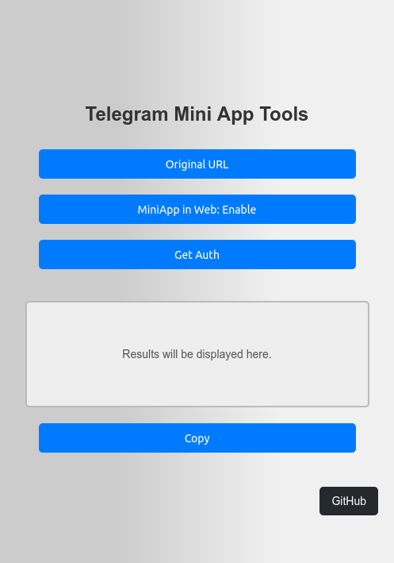

# Telegram Mini App Tools
**This is a Chrome Extension that helps you to:**

+ Get the authorization token
+ Open Mini Apps from Telegram Web
+ Get the original URL of Mini Apps
+ You can copy messages from restricted channels

**It works with most Mini Apps using the Telegram Web version, even if the app does not normally function in the web version.**


## build
```npm run build```

## Screenshots



## Credits

 + [ButterDevelop/TelegramMiniAppAuthExtractor](https://github.com/ButterDevelop/TelegramMiniAppAuthExtractor)

 + [NabiKAZ](https://gist.github.com/NabiKAZ/10ab0c25c0703d5d3f5b9b4acd500c66)
